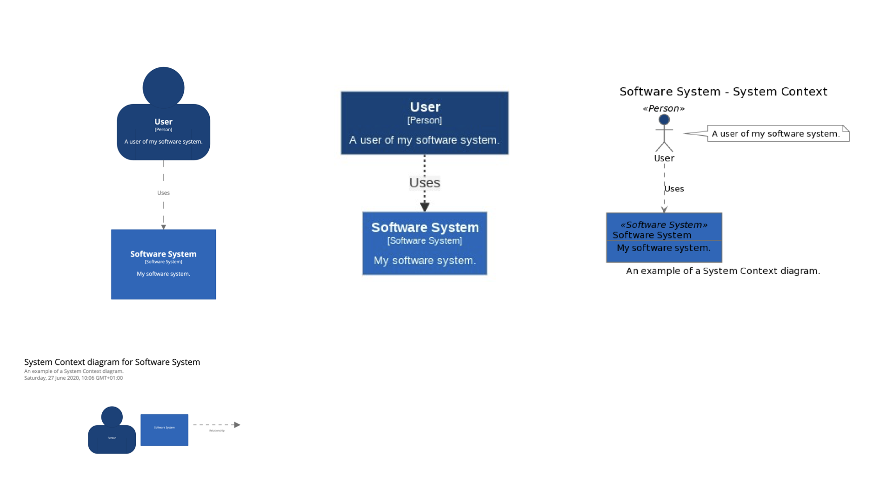

# Structurizr DSL

This GitHub repository contains an implementation of the Structurizr DSL - a way to create Structurizr software architecture models based upon the [C4 model](https://c4model.com) using a textual domain specific language (DSL). The Structurizr DSL has appeared on the [ThoughtWorks Tech Radar - Techniques - Diagrams as code](https://www.thoughtworks.com/radar/techniques?blipid=202010027).

* [Getting started](docs/getting-started.md)
* [Language reference](docs/language-reference.md)

## A quick example

As an example, the following text can be used to create a software architecture __model__ and an associated __view__ that describes a user using a software system.

```
workspace "Getting Started" "This is a model of my software system." {

    model {
        user = person "User" "A user of my software system."
        softwareSystem = softwareSystem "Software System" "My software system."

        user -> softwareSystem "Uses"
    }

    views {
        systemContext softwareSystem "SystemContext" "An example of a System Context diagram." {
            include *
            autoLayout
        }

        styles {
            element "Software System" {
                background #1168bd
                color #ffffff
            }
            element "Person" {
                shape person
                background #08427b
                color #ffffff
            }
        }
    }
    
}
```

([view this example](https://structurizr.com/dsl?src=https://raw.githubusercontent.com/structurizr/dsl/master/examples/getting-started.dsl))

## Multiple output formats

The view can then be exported to be visualised using the [Structurizr cloud service/on-premises installation](https://structurizr.com), or other formats including PlantUML, Mermaid, and WebSequenceDiagrams via the [Structurizr CLI](https://github.com/structurizr/cli).



See [Structurizr - Text as an architecture description language](https://structurizr.com/help/text) for more details.

## Convention over configuration, useful defaults

The DSL is designed to be as compact as possible. In conjunction with the Structurizr CLI, the following DSL fragment will automatically create the implied relationship between the ```user``` and ```softwareSystem``` elements, create three views with auto-layout enabled (1 x System Landscape, 1 x System Context, 1 x Container), and add some default element styles.

```
workspace {

    model {
        user = person "User"
        softwareSystem = softwareSystem "Software System" {
            webapp = container "Web Application"
            database = container "Database"
         }

        user -> webapp "Uses"
        webapp -> database "Reads from and writes to"
    }

}
```

([view this example](https://structurizr.com/dsl?src=https://gist.githubusercontent.com/simonbrowndotje/3eefa2b8adcbdef55ce6de4875b39f3a/raw/0c2dd656e091b2b61a70d2280c8a8b2cf0d90db8/workspace.dsl))

## Tooling support

Here are some tools designed to support the Structurizr DSL.

* [Structurizr DSL demo](https://structurizr.com/dsl)
* [Structurizr CLI](https://github.com/structurizr/cli)
* [VS Code extension - syntax highlighting and PlantUML previews](https://marketplace.visualstudio.com/items?itemName=systemticks.c4-dsl-extension)
* [VS Code extension - syntax highlighting](https://marketplace.visualstudio.com/items?itemName=ciarant.vscode-structurizr)

## Examples

* [Financial Risk System](https://structurizr.com/dsl?src=https://raw.githubusercontent.com/structurizr/dsl/master/examples/financial-risk-system.dsl)
* [Big Bank plc](https://structurizr.com/dsl?src=https://raw.githubusercontent.com/structurizr/dsl/master/examples/big-bank-plc.dsl)
* [Amazon Web Services](https://structurizr.com/dsl?src=https://raw.githubusercontent.com/structurizr/dsl/master/examples/amazon-web-services.dsl)