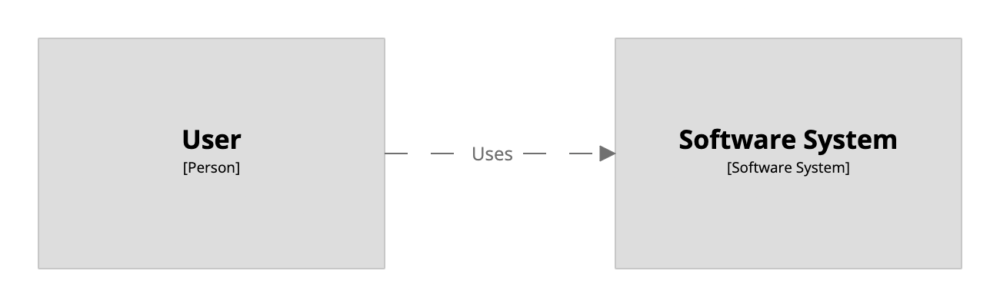

# Structurizr DSL

This GitHub repository contains an implementation of the Structurizr DSL - a way to create Structurizr software
architecture models based upon the [C4 model](https://c4model.com) using a textual domain specific language (DSL).
The Structurizr DSL has appeared on the
[ThoughtWorks Tech Radar - Techniques - Diagrams as code](https://www.thoughtworks.com/radar/techniques/diagrams-as-code)
and is text-based wrapper around the [Structurizr for Java library](https://github.com/structurizr/java).

## A quick example

As an example, the following text can be used to create a software architecture __model__ and
an associated __view__ that describes a user using a software system.

```
workspace {

    model {
        user = person "User"
        softwareSystem = softwareSystem "Software System"

        user -> softwareSystem "Uses"
    }

    views {
        systemContext softwareSystem {
            include *
            autolayout lr
        }
    }
    
}
```



##  Getting started

* [Structurizr DSL demo page](https://structurizr.com/dsl)
* [Getting started with Structurizr Lite](https://dev.to/simonbrown/getting-started-with-structurizr-lite-27d0) (using the DSL)
* [Diagrams as code 2.0](https://www.youtube.com/watch?v=Za1-v4Zkq5E) (video from GOTO Copenhagen 2021)

##  Reference

* [DSL Language reference](docs/language-reference.md)
* [DSL cookbook](docs/cookbook)
* [Changelog](docs/changelog.md)

## Examples

* [Getting started](https://structurizr.com/dsl?example=getting-started)
* [Big Bank plc](https://structurizr.com/dsl?example=big-bank-plc)
* [Amazon Web Services](https://structurizr.com/dsl?example=amazon-web-services)

## Rendering tools

The Structurizr DSL itself does not create diagrams, and is rendering tool independent,
there being a number of tools that can be used to render diagrams.
Please note that the feature set and look/feel of the resulting diagrams will vary between tools.

* [Structurizr Lite/on-premises/cloud service](https://structurizr.com): A browser-based diagram and documentation rendering tool with interactive diagrams, "double-click to zoom", etc.
* [c4viz](https://github.com/pmorch/c4viz): A browser-based diagram renderer, with diagram navigation and "click to zoom".
* [Structurizr Site Generatr](https://github.com/avisi-cloud/structurizr-site-generatr): Generates a HTML microsite with diagrams, documentation, and a UI to explore the model. 
* [Kroki](https://kroki.io): Kroki generates diagrams from a number of text-based formats, including the Structurizr DSL.
* [Git for Confluence | Markdown, PlantUML, Graphviz, Mermaid](https://marketplace.atlassian.com/apps/1211675/git-for-confluence-markdown-plantuml-graphviz-mermaid): A Confluence plugin that will render a specific diagram from a Structurizr DSL file stored in your git repo.
* [Structurizr Export](https://github.com/structurizr/export): A collection of Java classes to generate diagrams as PlantUML, Mermaid, D2, DOT, and WebSequenceDiagrams. An export to Ilograph is also available.
* [Structurizr CLI](https://github.com/structurizr/cli): A command line tool that bundles the Structurizr Export utilities.

## Other tooling support

* [VS Code extension](https://marketplace.visualstudio.com/items?itemName=systemticks.c4-dsl-extension) (syntax highlighting and diagram previews; please note that there are some known issues with the syntax highlighting - see [Divergences](https://gitlab.com/systemticks/c4-grammar/-/tree/master/extension#divergences) for more details, and [Examples](https://gitlab.com/systemticks/c4-grammar/-/tree/master/workspace) for examples that work correctly with the extension)
* [VS Code extension](https://marketplace.visualstudio.com/items?itemName=ciarant.vscode-structurizr) (syntax highlighting)
