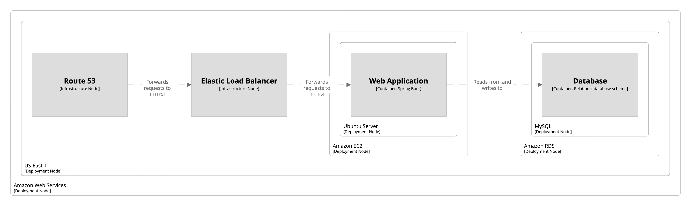
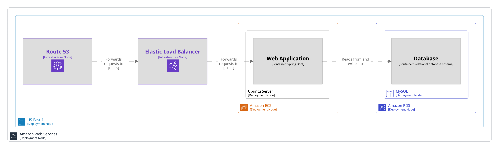
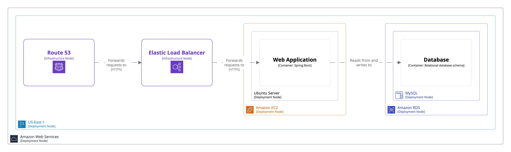

# Amazon Web Services

A [deployment view](../deployment-view) can be used to model the deployment of your software system onto Amazon Web Services.

```
workspace {

    model {
        u = person "User"
        s = softwareSystem "Software System" {
            webapp = container "Web Application" "" "Spring Boot"
            database = container "Database" "" "Relational database schema"
        }

        u -> webapp "Uses"
        webapp -> database "Reads from and writes to"
        
        live = deploymentEnvironment "Live" {
            deploymentNode "Amazon Web Services" {
                deploymentNode "US-East-1" {
                    route53 = infrastructureNode "Route 53"
                    elb = infrastructureNode "Elastic Load Balancer"

                    deploymentNode "Amazon EC2" {
                        deploymentNode "Ubuntu Server" {
                            webApplicationInstance = containerInstance webapp
                        }
                    }

                    deploymentNode "Amazon RDS" {
                        deploymentNode "MySQL" {
                            containerInstance database
                        }
                    }
                }
            }
            
            route53 -> elb "Forwards requests to" "HTTPS"
            elb -> webApplicationInstance "Forwards requests to" "HTTPS"
        }
    }

    views {
        deployment s live {
            include *
            autoLayout lr
        }
    }
    
}
```

This DSL defines a deployment environment named `Live`, with a hierarchy of deployment nodes showing the various AWS services in use for deployment. It also defines some infrastructure nodes representing services that don't have any software systems/containers deployed onto them.

[](http://structurizr.com/dsl?src=https://raw.githubusercontent.com/structurizr/dsl/master/docs/cookbook/amazon-web-services/example-1.dsl)

The [pre-built Amazon Web Services theme](https://structurizr.com/help/theme?url=https://static.structurizr.com/themes/amazon-web-services-2020.04.30/theme.json) can be used to add some colour, and make use of the AWS icon set.

```
workspace {

    model {
        u = person "User"
        s = softwareSystem "Software System" {
            webapp = container "Web Application" "" "Spring Boot"
            database = container "Database" "" "Relational database schema"
        }

        u -> webapp "Uses"
        webapp -> database "Reads from and writes to"
        
        live = deploymentEnvironment "Live" {
            deploymentNode "Amazon Web Services" {
                tags "Amazon Web Services - Cloud"
                
                deploymentNode "US-East-1" {
                    tags "Amazon Web Services - Region"
                
                    route53 = infrastructureNode "Route 53" {
                        tags "Amazon Web Services - Route 53"
                    }
                    elb = infrastructureNode "Elastic Load Balancer" {
                        tags "Amazon Web Services - Elastic Load Balancing"
                    }

                    deploymentNode "Amazon EC2" {
                        tags "Amazon Web Services - EC2"
                        
                        deploymentNode "Ubuntu Server" {
                            webApplicationInstance = containerInstance webapp
                        }
                    }

                    deploymentNode "Amazon RDS" {
                        tags "Amazon Web Services - RDS"
                        
                        deploymentNode "MySQL" {
                            tags "Amazon Web Services - RDS MySQL instance"
                            
                            containerInstance database
                        }
                    }
                }
            }
            
            route53 -> elb "Forwards requests to" "HTTPS"
            elb -> webApplicationInstance "Forwards requests to" "HTTPS"
        }
    }

    views {
        deployment s live {
            include *
            autoLayout lr
        }

        theme https://static.structurizr.com/themes/amazon-web-services-2020.04.30/theme.json
    }
    
}
```

This DSL adds some element tags, and a reference to the Amazon Web Services theme.

[](http://structurizr.com/dsl?src=https://raw.githubusercontent.com/structurizr/dsl/master/docs/cookbook/amazon-web-services/example-2.dsl)

Further styles can be added if desired too.

[](http://structurizr.com/dsl?src=https://raw.githubusercontent.com/structurizr/dsl/master/docs/cookbook/amazon-web-services/example-3.dsl)