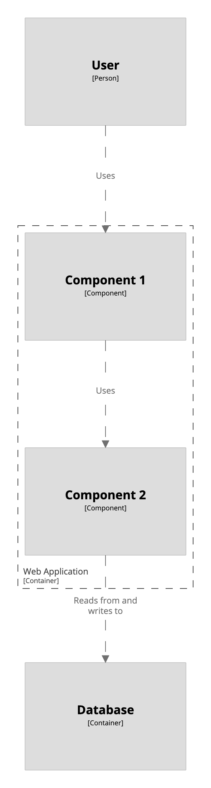

# Component view

A [component view](https://c4model.com/#ComponentDiagram) allows you to zoom-in to a container, to see the components that reside inside it.

```
workspace {

    model {
        u = person "User"
        s = softwareSystem "Software System" {
            webapp = container "Web Application" {
                c1 = component "Component 1"    
                c2 = component "Component 2"    
            }
            database = container "Database"
        }

        u -> c1 "Uses"
        c1 -> c2 "Uses"
        c2 -> database "Reads from and writes to"
    }

    views {
        component webapp {
            include *
            autoLayout
        }
    }
    
}
```

This DSL defines a component view for the container `webapp`, and `include *` includes the default set of model elements for the view.

[](http://structurizr.com/dsl?src=https://raw.githubusercontent.com/structurizr/dsl/master/docs/cookbook/component-view/1.dsl)

Component views can be rendered using the Structurizr cloud service/on-premises installation or exported to a number of other formats via the [Structurizr CLI export command](https://github.com/structurizr/cli/blob/master/docs/export.md).

## Links

- [DSL language reference - component](https://github.com/structurizr/dsl/blob/master/docs/language-reference.md#component-view)