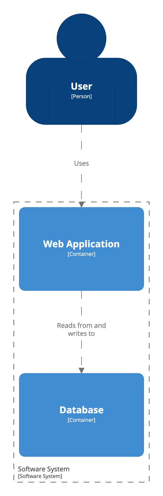

# Container view

A [Container view](https://c4model.com/#ContainerDiagram) allows you to zoom-in to the software system shown on a System Context view, to see the applications and data stores (what the C4 model refers to as "containers") that reside inside it.

```
workspace {

    model {
        u = person "User"
        s = softwareSystem "Software System" {
            webapp = container "Web Application"
            database = container "Database"
        }

        u -> webapp "Uses"
        webapp -> database "Reads from and writes to"
    }

    views {
        container s {
            include *
            autoLayout
        }
    }
    
}
```

This DSL defines a Container view for the software system `s`, and `include *` includes the default set of model elements for the view.



Container views can be rendered using the Structurizr cloud service/on-premises installation or exported to a number of other formats via the [Structurizr CLI export command](https://github.com/structurizr/cli/blob/master/docs/export.md).

## Links

- [DSL language reference - container](https://github.com/structurizr/dsl/blob/master/docs/language-reference.md#container-view)
- [Example](http://structurizr.com/dsl?src=https://raw.githubusercontent.com/structurizr/dsl/master/docs/cookbook/container-view/example.dsl)