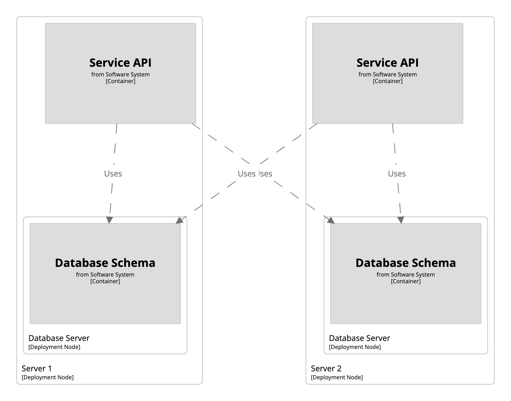
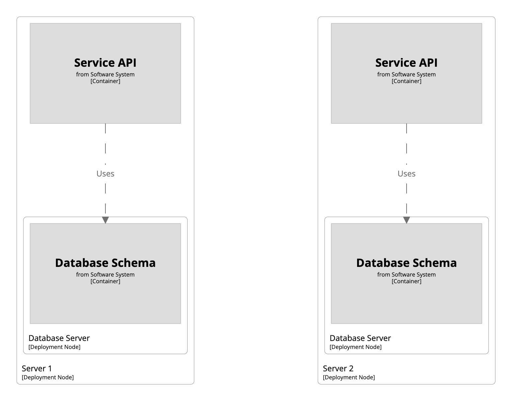

# Deployment groups

Imagine that you have a service comprised of an API and a database scheme, which are deployed together onto a single server.
Now let's say there are two instances of this entire service, each deployed onto a separate server.

```
workspace {

    model {
        softwareSystem = softwareSystem "Software System" {
            database = container "Database Schema"
            api = container "Service API" {
                -> database "Uses"
            }
        }

        production = deploymentEnvironment "Production" {
            deploymentNode "Server 1" {
                containerInstance api
                deploymentNode "Database Server" {
                    containerInstance database
                }
            }
            deploymentNode "Server 2" {
                containerInstance api
                deploymentNode "Database Server" {
                    containerInstance database
                }
            }
        }
    }

    views {
        deployment * production {
            include *
            autolayout
        }
    }

}
```

The container instance to container instance relationships are based upon the container to container relationships
defined in the static structurizr part of the model.
While this works out of the box in many cases, here we can see that the "Service API" on "Server 1" has a connection to the "Database Schema" on "Server 2", and vice versa.

[](http://structurizr.com/dsl?src=https://raw.githubusercontent.com/structurizr/dsl/master/docs/cookbook/deployment-groups/example-1.dsl)

If this is not the desired behaviour, you can use the "deployment group" feature.
This provides a way to group software system/container instances and restrict how relationships are created.
For example, we can create two deployment groups, and place one instance of both the "Service API" and "Database Schema" in each.

```

```

[](http://structurizr.com/dsl?src=https://raw.githubusercontent.com/structurizr/dsl/master/docs/cookbook/deployment-groups/example-2.dsl)

## Links

- [DSL language reference - deploymentGroup](https://github.com/structurizr/dsl/blob/master/docs/language-reference.md#deploymentGroup)