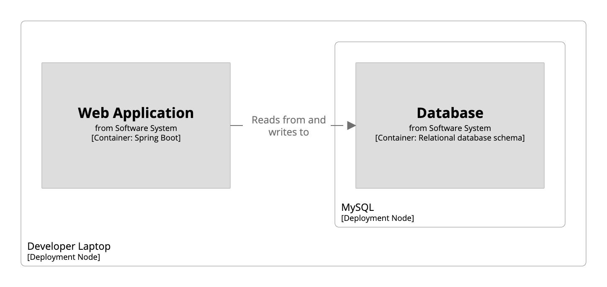

# Deployment view

A [deployment view](https://c4model.com/#DeploymentDiagram) allows you to show how software systems and containers are deployed, by showing the mapping of software system and container _instances_ onto deployment nodes.

```
workspace {

    model {
        u = person "User"
        s = softwareSystem "Software System" {
            webapp = container "Web Application" "" "Spring Boot"
            database = container "Database" "" "Relational database schema"
        }

        u -> webapp "Uses"
        webapp -> database "Reads from and writes to"
        
        development = deploymentEnvironment "Development" {
            deploymentNode "Developer Laptop" {
                containerInstance webapp
                deploymentNode "MySQL" {
                    containerInstance database
                }
            }
        }
    }

    views {
        deployment * development {
            include *
            autoLayout lr
        }
    }
    
}
```

This DSL defines a deployment environment named `Development`, with instances of the `webapp` and `database` containers deployed onto some deployment nodes. It also defines a deployment view for this deployment environment, and `include *` includes the default set of model elements for the view.

[](http://structurizr.com/dsl?src=https://raw.githubusercontent.com/structurizr/dsl/master/docs/cookbook/deployment-view/example-1.dsl)

Deployment views can be rendered using the Structurizr cloud service/on-premises installation or exported to a number of other formats via the [Structurizr CLI export command](https://github.com/structurizr/cli/blob/master/docs/export.md).

## Links

- [DSL language reference - deployment](https://github.com/structurizr/dsl/blob/master/docs/language-reference.md#deployment-view)