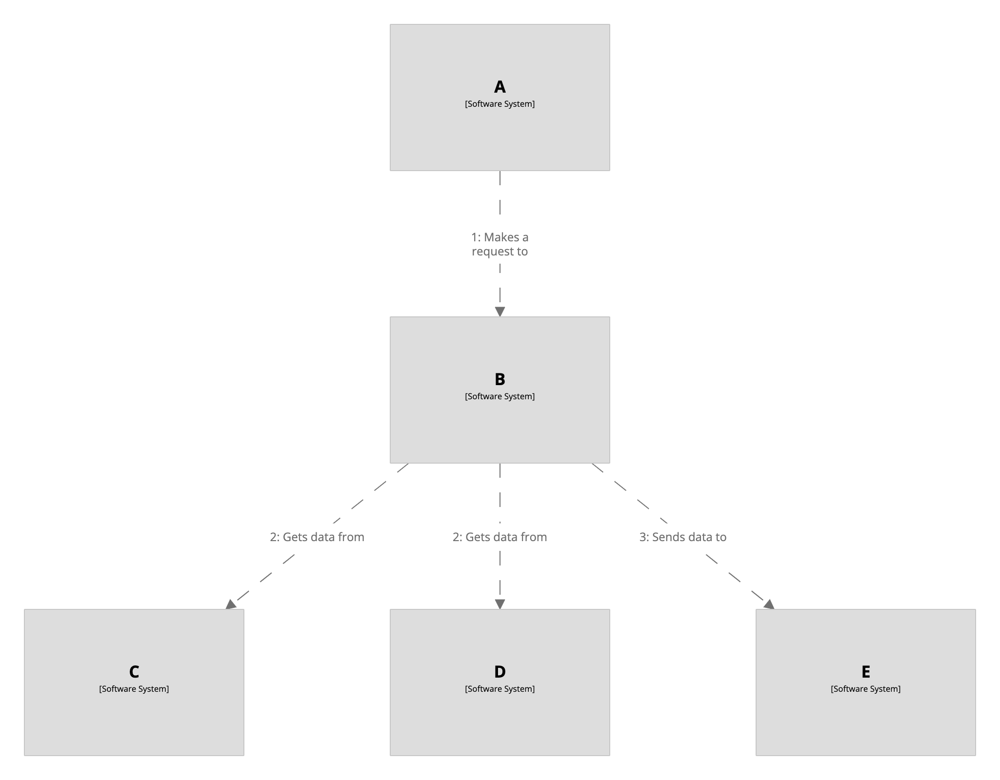

# Dynamic view with parallel sequences

Dynamic views can also be used to show parallel sequences of interactions, to indicate some degree of concurrency.
To do this, you can use the DSL block syntax `{` and `}` to define parallel sequences.

```
workspace {

    model {
        a = softwareSystem "A"
        b = softwareSystem "B"
        c = softwareSystem "C"
        d = softwareSystem "D"
        e = softwareSystem "E"

        a -> b
        b -> c
        b -> d
        b -> e
    }

    views {

        dynamic * {
            a -> b "Makes a request to"
            {
                {
                    b -> c "Gets data from"
                }
                {
                    b -> d "Gets data from"
                }
            }
            b -> e "Sends data to"

            autoLayout
        }
    }

}
```

[](http://structurizr.com/dsl?src=https://raw.githubusercontent.com/structurizr/dsl/master/docs/cookbook/dynamic-view-parallel/example-1.dsl)

Please note that support for parallel sequences via the DSL is relatively limited.

## Links

- [DSL language reference - dynamic](https://github.com/structurizr/dsl/blob/master/docs/language-reference.md#dynamic-view)