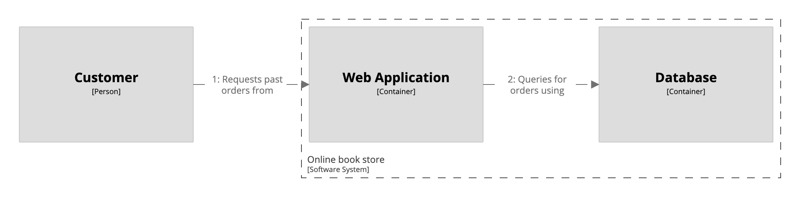

# Dynamic view

A [dynamic view](https://c4model.com/#DynamicDiagram) allows you to show a subset of the elements in a model, and the relationships between them, in order to describe how a particular use case/story/feature works. Dynamic views show ordered __instances__ of relationships, therefore reducing the number of relationships you need to define in the static model - see [Modelling multiple relationships](https://dev.to/simonbrown/modelling-multiple-relationships-51bf) for more.

```
workspace {

    model {
        customer = person "Customer"
        onlineBookStore = softwareSystem "Online book store" {
            webapp = container "Web Application"
            database = container "Database"
        }

        customer -> webapp "Browses and makes purchases using"
        webapp -> database "Reads from and writes to"
    }

    views {
        container onlineBookStore {
            include *
            autoLayout lr
        }
        
        dynamic onlineBookStore {
            title "Request past orders feature"
            customer -> webapp "Requests past orders from"
            webapp -> database "Queries for orders using"
            autoLayout lr
        }
        
        dynamic onlineBookStore {
            title "Browse top 20 books feature"
            customer -> webapp "Requests the top 20 books from"
            webapp -> database "Queries the top 20 books using"
            autoLayout lr
        }
    }
    
}
```

This DSL defines three views:

1. A container view showing the user and containers - notice how the relationship between the user and the web application is quite general ("Browses and makes purchases using").
2. A dynamic view for the "request past orders" feature.
2. A dynamic view for the "browse top 20 books" feature.

[](http://structurizr.com/dsl?src=https://raw.githubusercontent.com/structurizr/dsl/master/docs/cookbook/dynamic-view/example-1.dsl)

## Links

- [DSL language reference - dynamic](https://github.com/structurizr/dsl/blob/master/docs/language-reference.md#dynamic-view)