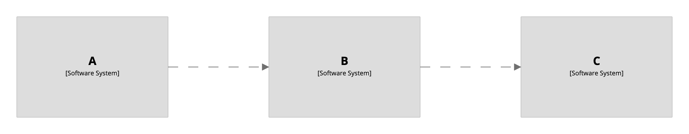
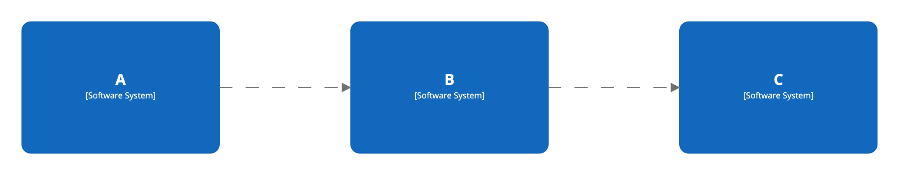
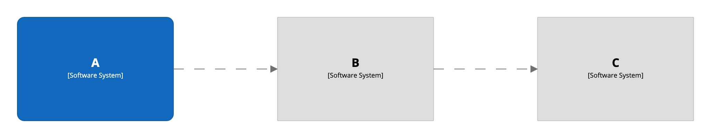

# Element styles

By default all elements are styled as grey boxes.

[](http://structurizr.com/dsl?src=https://raw.githubusercontent.com/structurizr/dsl/master/docs/cookbook/element-styles/example-1.dsl)

## Styling all elements

To change the style for all elements, add an element style for the `Element` tag.

```
workspace {

    model {
        a = softwareSystem "A"
        b = softwareSystem "B"
        c = softwareSystem "C"

        a -> b
        b -> c
    }

    views {
        systemLandscape {
            include *
            autolayout lr
        }
        
        styles {
            element "Element" {
                background #1168bd
                color #ffffff
                shape RoundedBox
            }
        }
    }
    
}
```

[](http://structurizr.com/dsl?src=https://raw.githubusercontent.com/structurizr/dsl/master/docs/cookbook/element-styles/example-2.dsl)

## Styling individual elements

To change the style of an individual element:

1. Tag the element.
2. Add an element style for that tag.

```
workspace {

    model {
        a = softwareSystem "A" {
            tags "Tag 1"
        }
        b = softwareSystem "B"
        c = softwareSystem "C"

        a -> b
        b -> c
    }

    views {
        systemLandscape {
            include *
            autolayout lr
        }
        
        styles {
            element "Tag 1" {
                background #1168bd
                color #ffffff
                shape RoundedBox
            }
        }
    }
    
}
```

[](http://structurizr.com/dsl?src=https://raw.githubusercontent.com/structurizr/dsl/master/docs/cookbook/element-styles/example-3.dsl)

## Notes

Please note that element styles are designed to work with the Structurizr cloud service/on-premises installation, and may not be fully supported by the PlantUML, Mermaid, etc export formats. 

- [DSL language reference - styles - element](https://github.com/structurizr/dsl/blob/master/docs/language-reference.md#element-style)