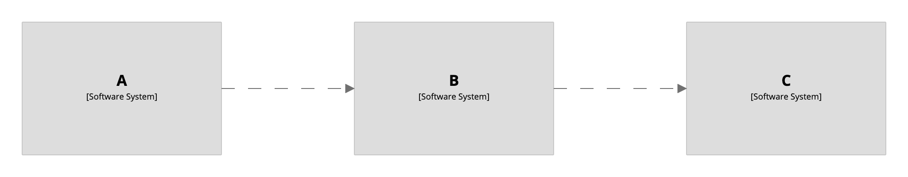
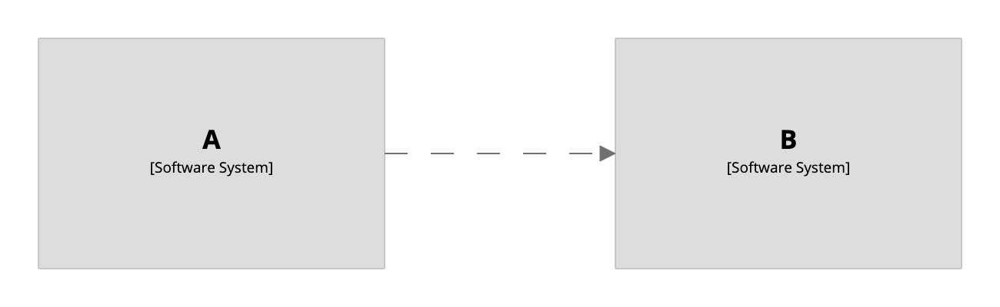
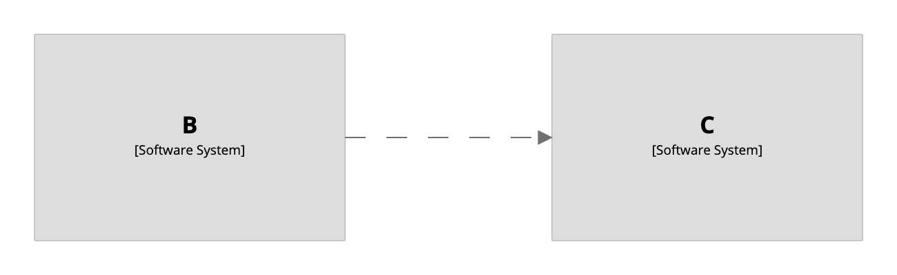

# Filtered view

A [filtered view](https://structurizr.com/help/filtered-views) represents "a view on top of another view", which can be used to filter (`include` or `exclude`) specific elements and/or relationships, based upon their tag. Consider the following workspace definition:

```
workspace {

    model {
        a = softwareSystem "A" {
            tags "Tag 1"
        }
        b = softwareSystem "B" {
            tags "Tag 2"
        }
        c = softwareSystem "C" {
            tags "Tag 3"
        }
        
        a -> b
        b -> c
    }
    
    views {
        systemLandscape "landscape" {
            include *
            autolayout lr
        }
    }
        
}
```

This DSL defines three software systems with relationships between them, and a system landscape view showing those software systems.

[](http://structurizr.com/dsl?src=https://raw.githubusercontent.com/structurizr/dsl/master/docs/cookbook/filtered-view/example-1.dsl)

The filtered view feature can be used to define views on top of this system landscape view. For example, the following DSL defines two filtered views:

```
workspace {

    model {
        a = softwareSystem "A" {
            tags "Tag 1"
        }
        b = softwareSystem "B" {
            tags "Tag 2"
        }
        c = softwareSystem "C" {
            tags "Tag 3"
        }
        
        a -> b
        b -> c
    }
    
    views {
        systemLandscape "landscape" {
            include *
            autolayout lr
        }
        
        filtered "landscape" include "Tag 1,Tag 2,Relationship" "landscape1"
        filtered "landscape" exclude "Tag 1" "landscape2"
    }
        
}
```

The first of these filtered views includes all elements/relationships that are tagged `Tag 1`, `Tag 2`, or `Relationship`.

```
filtered "landscape" include "Tag 1,Tag 2,Relationship" "landscape1"
```

[](http://structurizr.com/dsl?src=https://raw.githubusercontent.com/structurizr/dsl/master/docs/cookbook/filtered-view/example-2.dsl)

And the second excludes all elements/relationships that are tagged `Tag 1`.

```
filtered "landscape" exclude "Tag 1" "landscape2"
```

[](http://structurizr.com/dsl?src=https://raw.githubusercontent.com/structurizr/dsl/master/docs/cookbook/filtered-view/example-2.dsl)

When using filtered views, you'll notice that the original "base view" no longer shows in the list of viewable diagrams. This is by design. If you'd like to see the base view, you will need to create another filtered view that shows all elements and elements. For example:

```
filtered "landscape" include "Element,Relationship" "landscape-all"
```

[](http://structurizr.com/dsl?src=https://raw.githubusercontent.com/structurizr/dsl/master/docs/cookbook/filtered-view/example-3.dsl)

## Links

- [DSL language reference - filtered](https://github.com/structurizr/dsl/blob/master/docs/language-reference.md#filtered-view)