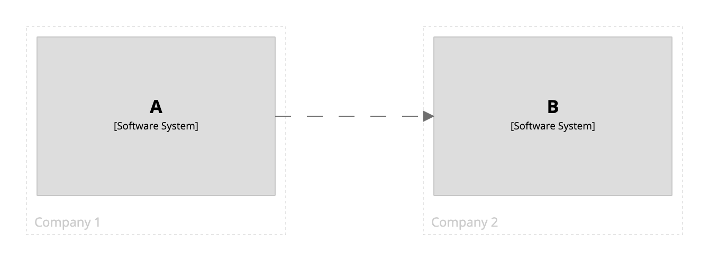
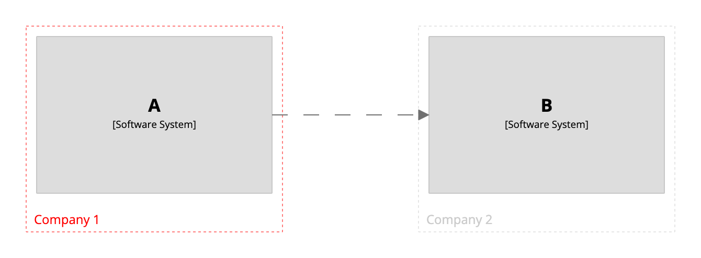
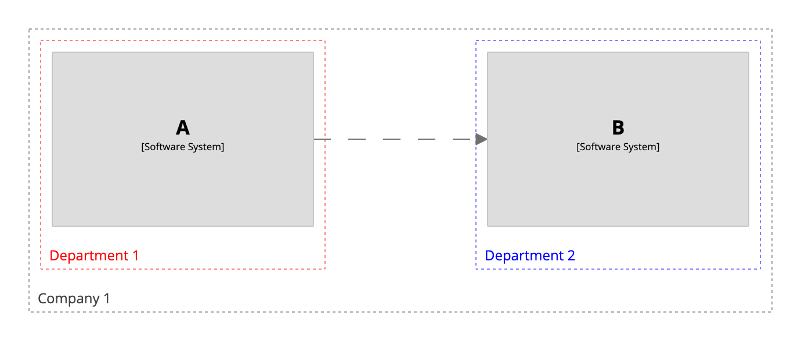

# Groups

The `group` keyword provides a way to define a named grouping of elements, which will be rendered as a boundary around those elements.
See [DSL language reference - group](../../language-reference.md#group) for more details.

## Example

Here is an example of a system landscape diagram that uses groups to represent organisational boundaries.

```
workspace {

    model {
        group "Company 1" {
            a = softwareSystem "A"
        }
        
        group "Company 2" {
            b = softwareSystem "B"
        }

        a -> b
    }

    views {
        systemLandscape {
            include *
            autolayout lr
        }
    }
    
}
```

[](http://structurizr.com/dsl?src=https://raw.githubusercontent.com/structurizr/dsl/master/docs/cookbook/groups/example-1.dsl)

## Styling all groups

By default, groups are shown as dashed boundaries with a light grey colour.
This can be customised via an element style, as described at [Structurizr - Notation](https://structurizr.com/help/notation).

To change the style for all groups, add an element style for the `Group` tag.

```
workspace {

    model {
        group "Company 1" {
            a = softwareSystem "A"
        }
        
        group "Company 2" {
            b = softwareSystem "B"
        }

        a -> b
    }

    views {
        systemLandscape {
            include *
            autolayout lr
        }
        
        styles {
            element "Group" {
                color #ff0000
            }
        }
    }
    
}
```

[](http://structurizr.com/dsl?src=https://raw.githubusercontent.com/structurizr/dsl/master/docs/cookbook/groups/example-2.dsl)

## Styling individual groups

To change the style of an individual group, add an element style for the `Group:XXX` tag, where `XXX` is the name of the group.

```
workspace {

    model {
        group "Company 1" {
            a = softwareSystem "A"
        }
        
        group "Company 2" {
            b = softwareSystem "B"
        }

        a -> b
    }

    views {
        systemLandscape {
            include *
            autolayout lr
        }
        
        styles {
            element "Group:Company 1" {
                color #ff0000
            }
        }
    }
    
}
```

[](http://structurizr.com/dsl?src=https://raw.githubusercontent.com/structurizr/dsl/master/docs/cookbook/groups/example-3.dsl)

## Nested groups

Groups can also be nested. Element groups are defined as a single string property on the element named `group`,
and defining nested groups requires a separator to be defined that will be used to split this single string into a set of hierarchical/nested groups.
To do this, add a model property named `structurizr.groupSeparator` that defines a separator to use, and be sure to not use this separator in your group names.

```
workspace {

    model {
        properties {
            "structurizr.groupSeparator" "/"
        }
        
        group "Company 1" {
            group "Department 1" {
                a = softwareSystem "A"
            }

            group "Department 2" {
                b = softwareSystem "B"
            }
        }

        a -> b
    }

    views {
        systemLandscape {
            include *
            autolayout lr
        }
    }
    
}
```

[](http://structurizr.com/dsl?src=https://raw.githubusercontent.com/structurizr/dsl/master/docs/cookbook/groups/example-4.dsl)

## Notes

Please note that element styles are designed to work with the Structurizr cloud service/on-premises installation/Lite, and may not be fully supported by the PlantUML, Mermaid, etc export formats.
Only the `color` and `icon` properties can be customised for groups.

- [Structurizr - Notation](https://structurizr.com/help/notation)