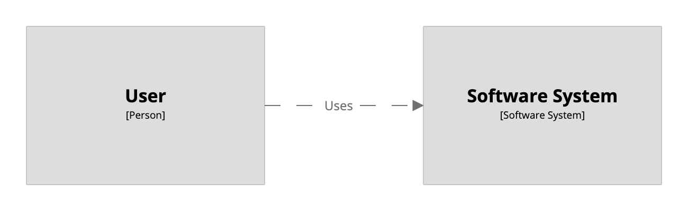
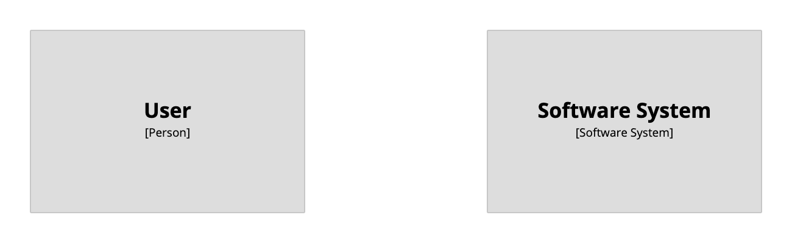
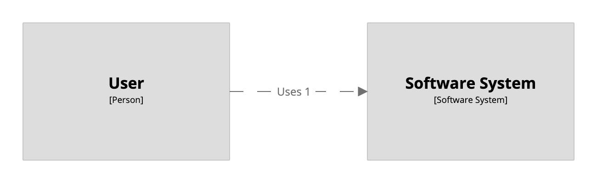
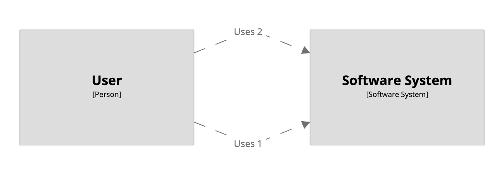

# Implied relationships

By default, the Structurizr DSL will create "implied relationships" automatically. For example, consider the following DSL, which defines a relationship between a person and a container.

```
workspace {

    model {
        u = person "User"
        s = softwareSystem "Software System" {
            webapp = container "Web Application"
        }

        u -> webapp "Uses"
    }

    views {
        systemContext s {
            include *
            autoLayout lr
        }
    }
    
}
```

Although the DSL does not define an explicit relationship between the person and the software system, this relationship is implied because of the relationship between the person and the container that resides inside the software system.

[](http://structurizr.com/dsl?src=https://raw.githubusercontent.com/structurizr/dsl/master/docs/cookbook/implied-relationships/example-1.dsl)

## Disabling implied relationships

This functionality can be disabled using the `!impliedRelationships` keyword. For example:

```
workspace {

    !impliedRelationships false

    model {

        u = person "User"
        s = softwareSystem "Software System" {
            webapp = container "Web Application"
        }

        u -> webapp "Uses"
    }

    views {
        systemContext s {
            include u s
            autoLayout
        }
    }
    
}
```

[](http://structurizr.com/dsl?src=https://raw.githubusercontent.com/structurizr/dsl/master/docs/cookbook/implied-relationships/example-2.dsl)

With the implied relationships functionality disabled, you will need to explicitly define every relationship that you want to see on your diagrams.

## Multiple implied relationships

The Structurizr DSL uses the [CreateImpliedRelationshipsUnlessAnyRelationshipExistsStrategy](https://github.com/structurizr/java/blob/master/docs/implied-relationships.md#createimpliedrelationshipsunlessanyrelationshipexistsstrategy) from the Java client library when creating implied relationships, which prevents multiple implied relationships from being created. For example, the following DSL will only create a single implied relationship between the person and the software system (the first that is defined in the DSL).

```
workspace {

    model {
        u = person "User"
        s = softwareSystem "Software System" {
            webapp = container "Web Application"
        }

        u -> webapp "Uses 1"
        u -> webapp "Uses 2"
    }

    views {
        systemContext s {
            include *
            autoLayout lr
        }
    }
    
}
```

[](http://structurizr.com/dsl?src=https://raw.githubusercontent.com/structurizr/dsl/master/docs/cookbook/implied-relationships/example-3.dsl)

To show both relationships, you will need to explitly define them, as follows:

```
workspace {

    model {
        u = person "User"
        s = softwareSystem "Software System" {
            webapp = container "Web Application"
        }

        u -> s "Uses 1"
        u -> s "Uses 2"
        u -> webapp "Uses 1"
        u -> webapp "Uses 2"
    }

    views {
        systemContext s {
            include *
            autoLayout lr
        }
    }
    
}
```

[](http://structurizr.com/dsl?src=https://raw.githubusercontent.com/structurizr/dsl/master/docs/cookbook/implied-relationships/example-4.dsl)

A better approach is to collapse multiple relationships into a single description, modelling the summary of all relationships rather than each individual relationship. This leads to less cluttered diagrams. See  [Modelling multiple relationships](https://dev.to/simonbrown/modelling-multiple-relationships-51bf) for more on this topic.

## Links

- [DSL language reference - !impliedRelationships](https://github.com/structurizr/dsl/blob/master/docs/language-reference.md#impliedRelationships)