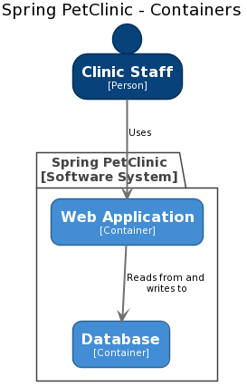

# Introduction

Creating software architecture diagrams from text is becoming more popular. Text is easy to work with, and it's version controllable, so it can be stored alongside your source code. Tools like [PlantUML](https://plantuml.com), [Mermaid](https://mermaid-js.github.io/mermaid/#/), and [WebSequenceDiagrams](https://www.websequencediagrams.com) have auto-layout algorithms that allow us to focus on content too.

In conjunction with the [C4 model](https://c4model.com), it's relatively straightforward to create a collection of diagrams to describe the project/product you're working on, at different levels of abstraction. For example, here's a [System Context diagram](https://c4model.com/#SystemContextDiagram) to describe a pet clinic information management system.


And here's a [Container diagram](https://c4model.com/#ContainerDiagram) showing the internals of the software system.



## But wait!

Did you spot the two errors in the Container diagram? Let's look at the diagrams next to each other.


- "Clinic Employee" has changed to "Clinic Staff".
- The arrow style has changed from dashed to solid.

Granted these are only minor differences, but the problem here is one of consistency. If you're defining two diagrams in two separate text files, it's easy to make mistakes. Also, perhaps we wanted to change the name of the user from "Clinic Employee" to "Clinic Staff", but we forgot to change both files or regenerate them both. Some of these problems can be partially solved with the global search and replace tooling we have at our disposal as software developers. And some problems can be solved by integrating the diagram generation process into a CI/CD pipeline. But there's a better way.

## Make models, not diagrams

What we're missing here is a single definition of the elements and relationships across all of our diagrams. When writing code, we often talk about DRY ([Don't repeat yourself](https://en.wikipedia.org/wiki/Don%27t_repeat_yourself)), where we try to avoid unnecessary duplication through copy-pasting code. That's exactly how many people create their diagrams though, by copy-pasting diagram definition fragments. PlantUML does support the concept of an [!include directive](https://mrhaki.blogspot.com/2016/12/plantuml-pleasantness-include-partial.html) to include fragments, but this can become complicated.

What we really want to do is create a model of our software architecture, and then visualise it from different angles. The [Structurizr DSL](https://github.com/structurizr/dsl) is an open source project that lets you do just this. Instead of writing two separate PlantUML files, we can define everything in a single file as follows.

```
workspace {

    model {
        clinicEmployee = person "Clinic Employee"
        springPetClinic = softwareSystem "Spring PetClinic"{
            webApplication = container "Web Application"
            database = container "Database"
        }

        clinicEmployee -> webApplication "Uses"
        webApplication -> database "Reads from and writes to"
    }

    views {
        systemContext springPetClinic {
            include *
            autolayout
        }

        container springPetClinic {
            include *
            autolayout
        }
    }
    
}
```

[View this example online](http://structurizr.com/dsl?src=https://raw.githubusercontent.com/structurizr/dsl/master/docs/cookbook/introduction/example.dsl)

This text defines a model containing: a user, a software system, two containers, and the relationships between everything. It also then defines two views of this model: one System Context view, and one Container view.

The DSL is a way to define software architecture models and views, but we still need a way to visualise that, and ultimately get some diagrams. We can do this with the [Structurizr CLI](https://github.com/structurizr/cli), another open source project that has a number of features.

```text
./structurizr.sh export -workspace example.dsl -format plantuml
```

Running the Structurizr CLI in this way will create two `.puml` files, which we can then render with PlantUML in the normal way.

 

Because both diagrams are created from the same model, they remain in sync, both from a content and a presentation perspective. Changes can now be made to the original DSL source file, and the diagrams regenerated.