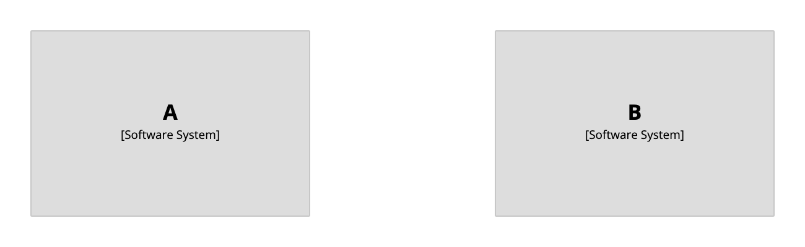

# Perspectives

Structurizr supports the concept of "perspectives" from [viewpoints and perspectives](https://www.viewpoints-and-perspectives.info/home/perspectives/), where you want to look at a diagram with a view to answering a particular question.
Perhaps you have a system landscape diagram showing software systems, and you'd like to see the ownership of each software system.
Or perhaps you have a container diagram, and you'd like to see details of how each container satisifies the security requirements.

Perspectives can be added to any model element or relationship; for example:

```
workspace {

    model {
        a = softwareSystem "A" {
            perspectives {
                "Ownership" "Team 1"
            }
        }
        
        b = softwareSystem "B" {
            perspectives {
                "Ownership" "Team 2"
            }
        }
    }

    views {
        systemLandscape {
            include *
            autoLayout
        }
    }
    
}
```

This DSL defines an "Ownership" perspective for each software system, which can be viewed by following the instructions at [Structurizr - Help - Perspectives](https://structurizr.com/help/perspectives).

[](http://structurizr.com/dsl?src=https://raw.githubusercontent.com/structurizr/dsl/master/docs/cookbook/perspectives/example-1.dsl&perspective=Ownership)

## Links

- [DSL language reference - perspectives](https://github.com/structurizr/dsl/blob/master/docs/language-reference.md#perspectives)