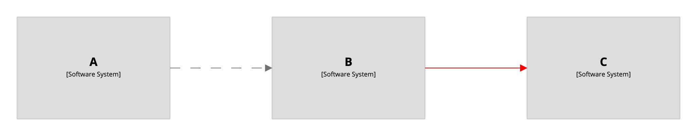

# Relationship styles

By default all relationships are styled as dashed grey lines.

[](http://structurizr.com/dsl?src=https://raw.githubusercontent.com/structurizr/dsl/master/docs/cookbook/relationship-styles/example-1.dsl)

## Styling all relationships

To change the style for all relationships, add a relationship style for the `Relationship` tag.

```
workspace {

    model {
        a = softwareSystem "A"
        b = softwareSystem "B"
        c = softwareSystem "C"

        a -> b
        b -> c
    }

    views {
        systemLandscape {
            include *
            autolayout lr
        }
        
        styles {
            relationship "Relationship" {
                color #ff0000
                dashed false
            }
        }
    }
    
}
```

[](http://structurizr.com/dsl?src=https://raw.githubusercontent.com/structurizr/dsl/master/docs/cookbook/relationship-styles/example-2.dsl)

## Styling individual relationships

To change the style of an individual relationship:

1. Tag the relationship.
2. Add a relationship style for that tag.

```
workspace {

    model {
        a = softwareSystem "A"
        b = softwareSystem "B"
        c = softwareSystem "C"

        a -> b
        b -> c {
            tags "Tag 1"
        }
    }

    views {
        systemLandscape {
            include *
            autolayout lr
        }
        
        styles {
            relationship "Tag 1" {
                color #ff0000
                dashed false
            }
        }
    }
    
}
```

[](http://structurizr.com/dsl?src=https://raw.githubusercontent.com/structurizr/dsl/master/docs/cookbook/relationship-styles/example-3.dsl)

## Notes

Please note that relationship styles are designed to work with the Structurizr cloud service/on-premises installation, and may not be fully supported by the PlantUML, Mermaid, etc export formats. 

- [DSL language reference - styles - relationship](https://github.com/structurizr/dsl/blob/master/docs/language-reference.md#relationship-style)