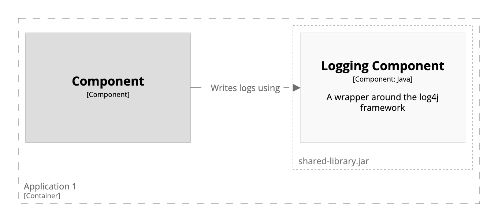

# Shared components

Diagramming components that are shared between containers is relatively straightforward with a combination of
`!identifiers hierarchical` and `!include`.

First, define your shared components in a DSL fragment, [for example](shared-library.dsl):

```
loggingComponent = component "Logging Component" {
    technology "Java"
    description "A wrapper around the log4j framework"
    tags "Shared Component"
}
```

Next, define your containers, and include the shared components using the `!include` statement: 

```
workspace {

    !identifiers hierarchical

    model {
        s = softwareSystem "Software System" {
            app1 = container "Application 1" {
                group "shared-library.jar" {
                    !include shared-library.dsl
                }

                c = component "Component" {
                    -> loggingComponent "Writes logs using"
                }
            }

            app2 = container "Application 2" {
                group "shared-library.jar" {
                    !include shared-library.dsl
                }

                c = component "Component" {
                    -> loggingComponent "Writes logs using"
                }
            }
        }
    }

    views {
        component s.app1 {
            include *
            autolayout lr
        }

        component s.app2 {
            include *
            autoLayout lr
        }

        styles {
            ...
        }
    }
    
}
```

The use of `!identifiers hierarchical` prevents the shared component identifiers from clashing,
and you can reference the shared components via `s.app1.loggingComponent` and `s.app2.loggingComponent` respectively if required.

This DSL also uses a group and differing notation to highlight the shared components.
The `group` statement has been included in the main DSL file in this example, but it could be moved to the `shared-library.dsl` file if desired.

[](http://structurizr.com/dsl?src=https://raw.githubusercontent.com/structurizr/dsl/master/docs/cookbook/shared-components/example-1.dsl)

## Links

- [The C4 model for visualising software architecture](https://leanpub.com/visualising-software-architecture) (this shows more strategies and examples for diagramming shared components)