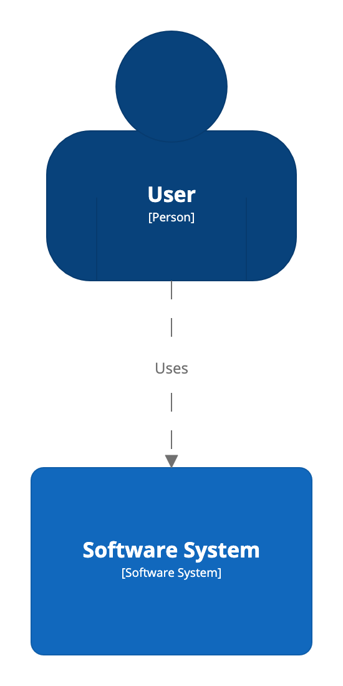

# System Context view

A [System Context view](https://c4model.com/#SystemContextDiagram) is a good starting point for diagramming and documenting a software system, allowing you to step back and see the big picture. It shows the software system in the centre, surrounded by its users and the other systems that it interacts with.

The following DSL shows an example of how to define a System Context view.

```
workspace {

    model {
        u = person "User"
        s = softwareSystem "Software System"

        u -> s "Uses"
    }

    views {
        systemContext s {
            include *
            autoLayout
        }
    }
    
}
```

This DSL defines a System Context view for the software system `s`, and `include *` includes all model elements that have a direct relationship with it.



System Context views can be rendered using the Structurizr cloud service/on-premises installation or exported to a number of other formats via the [Structurizr CLI export command](https://github.com/structurizr/cli/blob/master/docs/export.md).

## Links

- [DSL language reference - systemContext](https://github.com/structurizr/dsl/blob/master/docs/language-reference.md#systemContext-view)
- [Example](http://structurizr.com/dsl?src=https://raw.githubusercontent.com/structurizr/dsl/master/docs/cookbook/system-context-view/example.dsl)