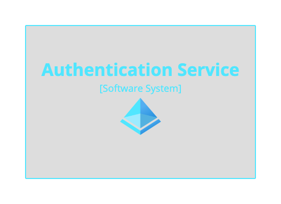
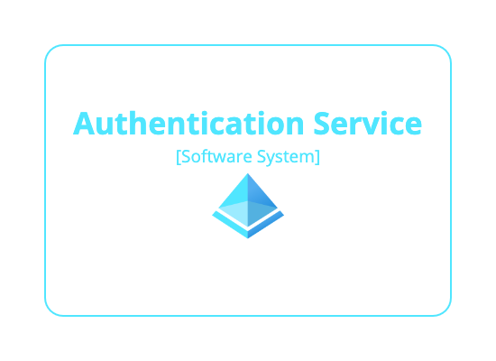

# Themes

Some pre-built themes are available to help you diagram deployment architectures that make use of popular cloud providers such as Amazon Web Services, Microsoft Azure, Google Cloud Platform, etc. Links to these themes can be found at [Structurizr - Help - Themes](https://structurizr.com/help/themes). You can also create your own themes.

## What is a theme?

A theme is a JSON file consisting of one or more element/relationship styles that are defined for specific tags. Themes need to be hosted at a publicly accessible URL, and hosted over HTTPS if you're using the Structurizr cloud service. For example, a pre-built Microsoft Azure theme can be found at the following URL:

- [https://static.structurizr.com/themes/microsoft-azure-2021.01.26/theme.json](https://static.structurizr.com/themes/microsoft-azure-2021.01.26/theme.json)

You can use the Structurizr theme browser to view the styles that are defined in the theme, with the following URL:

- [https://structurizr.com/help/theme?url=https://static.structurizr.com/themes/microsoft-azure-2021.01.26/theme.json](https://structurizr.com/help/theme?url=https://static.structurizr.com/themes/microsoft-azure-2021.01.26/theme.json)

## Using a theme

The ```theme``` or ```themes``` keywords can be used to include one or more themes in your workspace. You will also need to add the appropriate tags to your model elements/relationships.

```
workspace {

    model {
        softwareSystem "Authentication Service" {
            tags "Microsoft Azure - Azure Active Directory"
        }
    }

    views {
        systemLandscape {
            include *
            autoLayout lr
        }
        
        theme https://static.structurizr.com/themes/microsoft-azure-2021.01.26/theme.json
    }
    
}
```

[](http://structurizr.com/dsl?src=https://raw.githubusercontent.com/structurizr/dsl/master/docs/cookbook/themes/example-1.dsl)

For further customisation, themes can be used in conjunction with element/relationship styles that are defined in the workspace.

```
workspace {

    model {
        softwareSystem "Authentication Service" {
            tags "Microsoft Azure - Azure Active Directory"
        }
    }

    views {
        systemLandscape {
            include *
            autoLayout lr
        }
        
        styles {
            element "Software System" {
                background #ffffff
                shape RoundedBox
            }
        }
        
        theme https://static.structurizr.com/themes/microsoft-azure-2021.01.26/theme.json
    }
    
}
```

[](http://structurizr.com/dsl?src=https://raw.githubusercontent.com/structurizr/dsl/master/docs/cookbook/themes/example-2.dsl)

## Notes

Please note that themes are designed to work with the Structurizr cloud service/on-premises installation/Lite, and may not be fully supported by the PlantUML, Mermaid, etc export formats. 

- [DSL language reference - theme](https://github.com/structurizr/dsl/blob/master/docs/language-reference.md#theme)
- [DSL language reference - themes](https://github.com/structurizr/dsl/blob/master/docs/language-reference.md#themes)