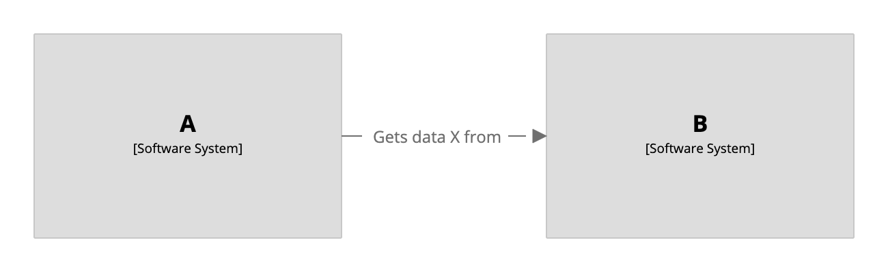
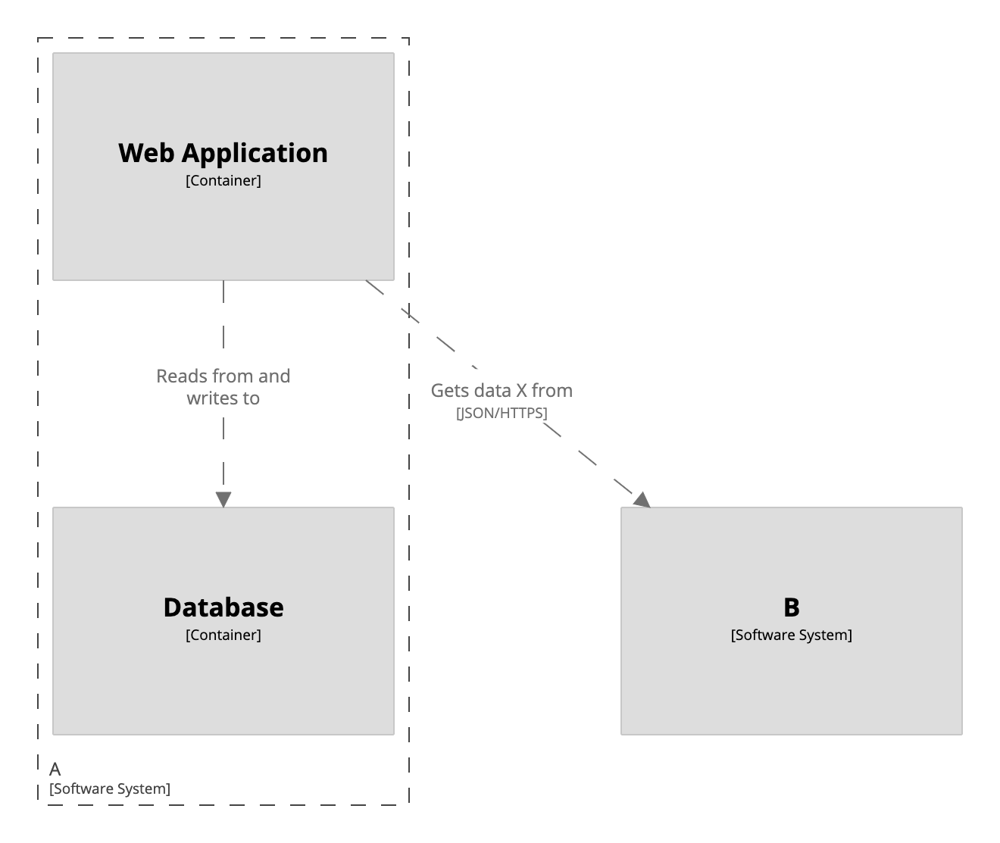

# Workspace extension

The Structurizr DSL provides a way to extend an existing workspace, enabling you to reuse common elements/relationships across multiple workspaces. To use this feature, define your workspace as normal. For example:

```
workspace {

    !identifiers hierarchical

    model {
        a = softwareSystem "A"
        b = softwareSystem "B"
        
        a -> b "Gets data X from"
    }
        
}
```

Next, define your child workspace, using the `extends` keyword to specify the workspace that should be extended. For example:

```
workspace extends https://raw.githubusercontent.com/structurizr/dsl/master/docs/cookbook/workspace-extension/system-landscape.dsl {

    model {
        !ref a {
            webapp = container "Web Application"
            database = container "Database"
            
            webapp -> b "Gets data X from"
            webapp -> database "Reads from and writes to"
        }
    }
    
    views {
        systemContext a "A-SystemContext" {
            include *
            autolayout lr
        }

        container a "A-Containers" {
            include *
            autolayout
        }
    }
    
}
```

In this example we're extending a workspace that's accessible via a public URL, but you can also specify the name of a local file. We can use the `!ref` keyword to extend the existing software system named "A", and identified in the parent workspace as `a`.

This will create a system context diagram:

[](http://structurizr.com/dsl?src=https://raw.githubusercontent.com/structurizr/dsl/master/docs/cookbook/workspace-extension/a.dsl?view=A-SystemContext)

And a container diagram:

[](http://structurizr.com/dsl?src=https://raw.githubusercontent.com/structurizr/dsl/master/docs/cookbook/workspace-extension/a.dsl?view=A-Containers)

## Links

- [DSL language reference - workspace](https://github.com/structurizr/dsl/blob/master/docs/language-reference.md#workspace)
- [DSL language reference - ref](https://github.com/structurizr/dsl/blob/master/docs/language-reference.md#ref)