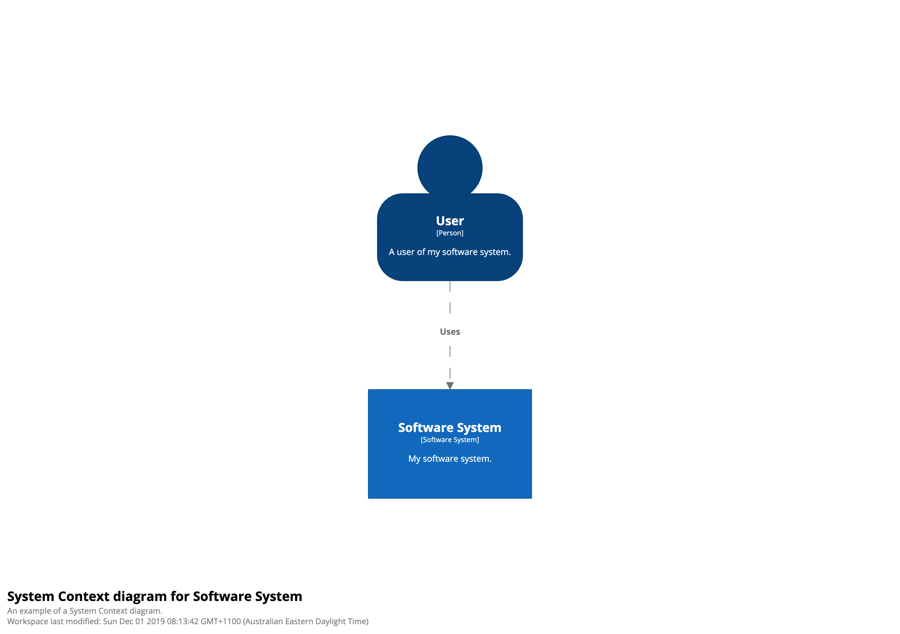

# Getting started

The Structurizr DSL provides a way to define a software architecture model as text, using a domain specific language (DSL). The [Structurizr CLI](https://github.com/structurizr/cli) (command line interface) provides tooling to parse DSL workspace definitions, upload them to the Structurizr cloud service/on-premises installation, and export diagrams to other formats (e.g. PlantUML, Mermaid, and WebSequenceDiagrams).

## 1. Download the Structurizr CLI

Download the Structurizr CLI from the [releases page](https://github.com/structurizr/cli/releases), and unzip. You will need Java (version 8+) installed, and available to use from your command line.

## 2. Create a software architecture model with the DSL

Create a new empty file with your favourite text editor, and copy the following text into it.

```
workspace "Getting Started" "This is a model of my software system." {

    model {
        user = person "User" "A user of my software system."
        softwareSystem = softwareSystem "Software System" "My software system."

        user -> softwareSystem "Uses"
    }

    views {
        systemContext softwareSystem "SystemContext" "An example of a System Context diagram." {
            include *
            autoLayout
        }

        styles {
            element "Software System" {
                background #1168bd
                color #ffffff
            }
            element "Person" {
                shape person
                background #08427b
                color #ffffff
            }
        }
    }
    
}
```

Save this file into the unzipped CLI directory.

This DSL definition:

- creates a person named "User"
- creates a software system named "Software System"
- creates a relationship between the person and the software system
- create a System Context view for the software system
- creates some element styles that will be applied when rendering the diagram

## 3. Upload to Structurizr

If you've not done so, follow [Structurizr - Getting started](https://structurizr.com/help/getting-started) to sign up for a free Structurizr account, and create a workspace. To upload your workspace to the Structurizr cloud service/on-premises installation, you will need your workspace ID, API key and secret. See [Structurizr - Workspaces](https://structurizr.com/help/workspaces) for information about finding these.

Open a terminal, and change to the unzipped CLI directory. Issue the following command to upload the workspace:

```
java -jar structurizr-cli-*.jar push -id WORKSPACE_ID -key KEY -secret SECRET -workspace WORKSPACE_FILE
```

- WORKSPACE_ID: your workspace ID
- API_KEY: your API key
- API_SECRET: your API secret
- WORKSPACE_FILE: the name of your workspace DSL file

## 4. Open the workspace in Structurizr

You can now sign in to your Structurizr account, and open the workspace from [your dashboard](https://structurizr.com/dashboard). Your workspace should now contain a diagram like this:

