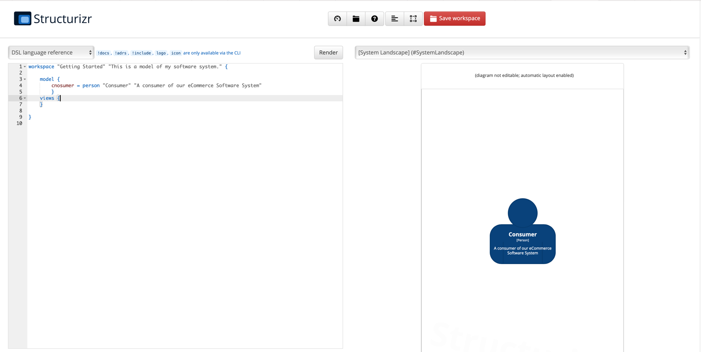
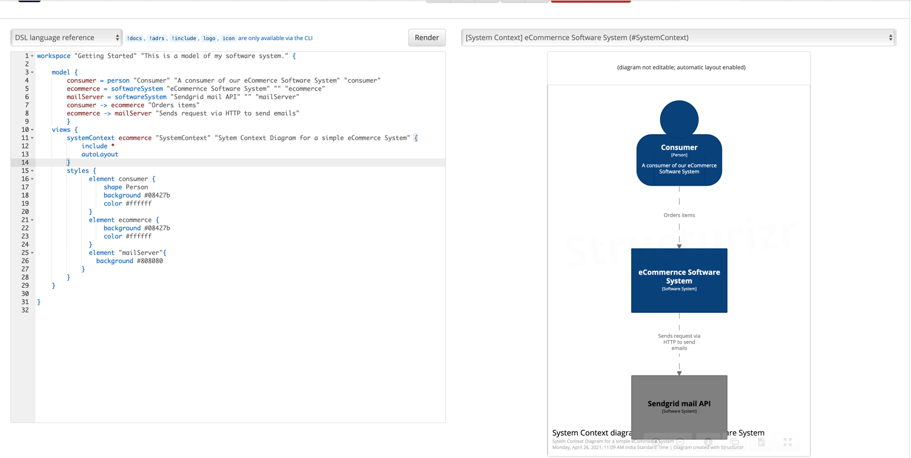

# Structurizr DSL Step by Step

In this tutorial, we will go through a step by step instruction of building architecture diagram of a very simple
eCommerce system.

As we build the diagrams, we will also familiarize ourselves with four "Cs" of C4 diagrams.

Let us start with creating a free account of Structurizr. Once you have done that, Structurizr will create one free workspace for you. To get started quickly, you can navigate to the URL that looks like the following.

`https://structurizr.com/workspace/6***7/dsl`
The hidden number is your workspace ID. The screen will look something like the following.

We will be using the editable space on the left to add our DSL and generate our first diagram.

The first C of the C4 diagram is a P!

**P**erson is the end-user of our software system. It is always helpful to start with defining the end-user of the
system. It sets the right context for the reader of the diagram.

This step is the first and the easiest to get started. Let's go ahead and define a person who is going to use this
software.

`consumer` on the LHS side is like a variable we will be able to use across different places. `person` on the RHS is
the type of diagram element. The other two strings followed by the keyword person are the title and the description for the diagram.

    workspace "Getting Started" "This is a model of my software system." {
        model {
            consumer = person "Consumer" "A consumer of our eCommerce Software System" 
            }
        views {
            
        }
    }

Pasting this code and hitting render will produce a screenshot that would look like Image 1 above.

The first level of the diagram is setting the **C**ontext. And this becomes our first `C` of C4. This is the highest
level of abstraction for our architecture diagram. At this level, we are setting the context about who will be our
primary users and what the system is. At this point, the system is just one big box, and we don't have any visibility about what it is made of and how it works.

Let's add that one big box by adding one more line of code.

    workspace "Getting Started" "This is a model of my software system." {

        model {
            consumer = person "Consumer" "A consumer of our eCommerce Software System"
            ecommerce = softwareSystem "eCommernce Software System" 
            }
        views {
        
        }
    }

Now our diagram still doesn't say much, let's go ahead and add a relationship between our user and our software system by adding this line of code `consumer -> eCommerce "Orders items"`

Any enterprise system works with multiple external systems. One such system, in our case, can be a mail server. We will add two more lines of code to add the mail server and create a relationship.
At this point, our code should look like the following. We have added a `styles` section to finetune the shapes and color of the diagram elements.

    workspace "Getting Started" "This is a model of my software system." {
    
        model {
            consumer = person "Consumer" "A consumer of our eCommerce Software System" "consumer"
            ecommerce = softwareSystem "eCommernce Software System" "" "ecommerce"
            mailServer = softwareSystem "Sendgrid mail API" "" "mailServer" 
            consumer -> ecommerce "Orders items"
            ecommerce -> mailServer "Sends request via HTTP to send emails"
            }
        views {
            systemContext ecommerce "SystemContext" "Sytem Context Diagram for a simple eCommerce System" {
                include *
                autoLayout
            }
            styles {
                  element consumer {
                      shape Person
                      background #08427b
                      color #ffffff
                  }
                  element ecommerce {
                      background #08427b
                      color #ffffff
                  }
                  element "mailServer"{
                    background #808080
                }
            }
        }
    
    }

The resulting diagram should look like this now. 

Now we are going to take a leap and create two containers and maybe a few components. Container, not to be confused with docker container, is the second level of abstraction. We know that our eCommerce system will have the following three high-level containers.

1. An application server
2. Database server to store item details
3. File server/service to store images

The new version of the code with relationships between these containers will look like the following.

    workspace "Getting Started" "This is a model of my software system." {
    
        model {
            consumer = person "Consumer" "A consumer of our eCommerce Software System" "consumer"
            ecommerce = softwareSystem "eCommernce Software System" "" "ecommerce"{
                appServer = container "App Server"
                database = container "MySQL Database"
                fileServer = container "NAS Drive to store all the files"
            }
            #relationships of software systems
            mailServer = softwareSystem "Sendgrid mail API" "" "mailServer" 
            consumer -> ecommerce "Orders items"
            ecommerce -> mailServer "Sends request via HTTP to send emails"
            
            #relationships of containers
            appServer -> database "Reads from and writes data to"
            appServer -> fileServer "Reads from and writes files to"
            }
        views {
            systemContext ecommerce "SystemContext" "Sytem Context Diagram for a simple eCommerce System" {
                include *
                autoLayout
            }
            container ecommerce "Containers" "Containers" {
                include *
                autoLayout
            }
            styles {
                  element "consumer" {
                      shape Person
                      background #08427b
                      color #ffffff
                  }
                  element "ecommerce" {
                      background #08427b
                      color #ffffff
                  }
                  element "Container" {
                      background #08427b
                      color #ffffff
                  }
                  element "mailServer"{
                    background #808080
                }
            }
        }
    
    }

We know that even the most straightforward eCommerce system will have many components like _purchase, fulfillment, payments, inventory_, etc. For this exercise, we will create just two components 1. Inventory 2. Image Display Service

Our final code with two components will look like the following.

    workspace "Getting Started" "This is a model of my software system." {
    
        model {
            consumer = person "Consumer" "A consumer of our eCommerce Software System" "consumer"
            ecommerce = softwareSystem "eCommernce Software System" "" "ecommerce"{
                appServer = container "App Server"{
                    inventory = component "Inventory Component"
                    imageService = component "Image Service"
                }
                database = container "MySQL Database"
                fileServer = container "NAS Drive to store all the files"
            }
            #relationships of software systems
            mailServer = softwareSystem "Sendgrid mail API" "" "mailServer" 
            consumer -> ecommerce "Orders items"
            ecommerce -> mailServer "Sends request via HTTP to send emails"
            
            #relationships of containers
            appServer -> database "Reads from and writes data to"
            appServer -> fileServer "Reads from and writes files to"
            
            #relationships of components
            inventory -> database "Changes quantities of the products based on orders placed"
            imageService -> fileServer "Retrieves product images using protocols like FTP"
            
            }
        views {
            systemContext ecommerce "SystemContext" "Sytem Context Diagram for a simple eCommerce System" {
                include *
                autoLayout
            }
            container ecommerce "Containers" "Containers" {
                include *
                autoLayout
            }
            component appServer "Components" "Components" {
                include *
                autoLayout
            }
            styles {
                  element "consumer" {
                      shape Person
                      background #08427b
                      color #ffffff
                  }
                  element "ecommerce" {
                      background #08427b
                      color #ffffff
                  }
                  element "Container" {
                      background #08427b
                      color #ffffff
                  }
                  element "Component" {
                      background #08427b
                      color #ffffff
                  }
                  
                  element "mailServer"{
                    background #808080
                }
            }
        }
    
    }

The 4th `C` of the system is `Code` and we are not going to jump into it in this tutorial. Now you are ready to go to your dashboard and navigate to your diagram's presentation mode. This will start displaying the diagram in full screen, and note that you can interact with the diagram components. Try double-clicking on the blue box of the eCommerce software system, and the diagram should navigate to a new page to display the containers.

This tutorial should now get you started to develop your own diagrams with the help of the 
[DSL references documentation](docs/language-reference.md).
